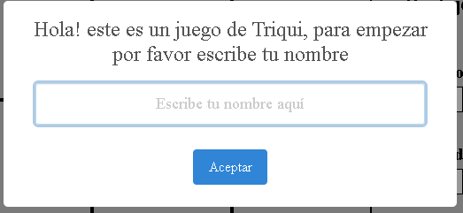

# Triqui Interactivo

## Descripción

¡Prepárate para desafiar tu mente con este emocionante juego de Triqui! Desarrollado completamente en el frontend con HTML, CSS y JavaScript, este juego interactivo te permite competir contra la computadora en diferentes niveles de dificultad. ¡Pon a prueba tus habilidades y lucha por la mejor puntuación!

## Enlace del Juego Desplegado

[https://johnalexf.github.io/Triqui/](https://johnalexf.github.io/Triqui/)

## Tecnologías Utilizadas

* **HTML:** Estructura la página web y los elementos del juego.
* **CSS:** Estiliza la interfaz del juego para una experiencia visual atractiva.
* **JavaScript:** Implementa la lógica del juego, la interacción con el usuario y el almacenamiento de datos para las puntuaciones.
* **SweetAlert:** Mejora la experiencia del usuario con alertas personalizadas y atractivas.

## Cómo Jugar

1.  **Ingresa tu Nombre:** Al iniciar el juego, introduce tu nombre para personalizar la experiencia. Este paso solo se realiza una vez por dispositivo.
2.  **Selecciona el Nivel de Dificultad:** Elige entre los diferentes niveles disponibles para ajustar el desafío a tus habilidades.
3.  **Realiza tus Movimientos:** Haz clic en una casilla vacía para marcar tu jugada.
4.  **Turno de la Computadora:** Después de tu movimiento, la computadora realizará su jugada automáticamente.
5.  **¡Disfruta del Juego!** Intenta alinear tres marcas en línea para ganar.
6.  **Nuevo Juego:** Si deseas empezar una nueva partida, haz clic en el botón correspondiente.

## Funcionalidades Detalladas

* **Bienvenida Personalizada:** Cada vez que ingresas al juego, recibirás un mensaje de bienvenida con tu nombre.
* **Selección de Nivel de Dificultad:** Elige el nivel que mejor se adapte a tu habilidad para un desafío óptimo.
* **Interacción Intuitiva:** Haz clic en las casillas para realizar tus movimientos de forma sencilla.
* **Jugada Automática de la Computadora:** La computadora realiza sus movimientos de forma automática para un juego fluido.
* **Reinicio Rápido:** Inicia una nueva partida con un solo clic.

## Instalación y Ejecución Local

1.  **Clonar el Repositorio:**

    ```bash
    git clone [<URL_DEL_REPOSITORIO_GIT>](https://github.com/johnalexf/Triqui)
    ```

    *(https://github.com/johnalexf/Triqui)*

2.  **Abrir con Live Server (Recomendado):**

    * Abre el archivo `index.html` en tu navegador web.
    * Si usas Visual Studio Code, instala la extensión "Live Server" y haz clic derecho en `index.html` para "Open with Live Server".

## Capturas de Pantalla 

#### Escribe tu nombre:
Este paso solo se realiza una vez por dispositivo.


#### Bienvenida:
Cada vez que vuelvas a ingresar, se mostrara un mensaje de bienvenida.


#### Elije el nivel


#### Elije la opción con la cual deseas jugar


#### Haz clic sobre la casilla en la cual quieres poner tu jugada
Automáticamente después el programa el PC dibujara la jugada de él.


#### Si deseas empezar un nuevo juego haz clic en el botón


